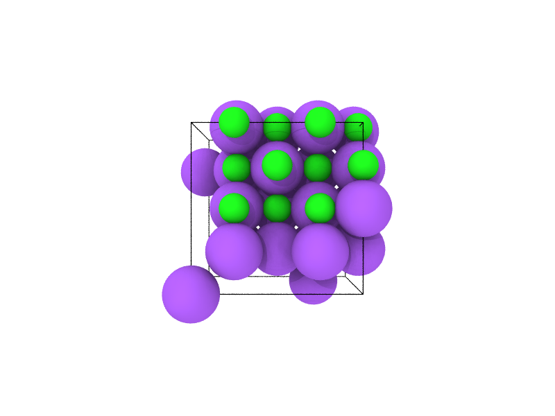
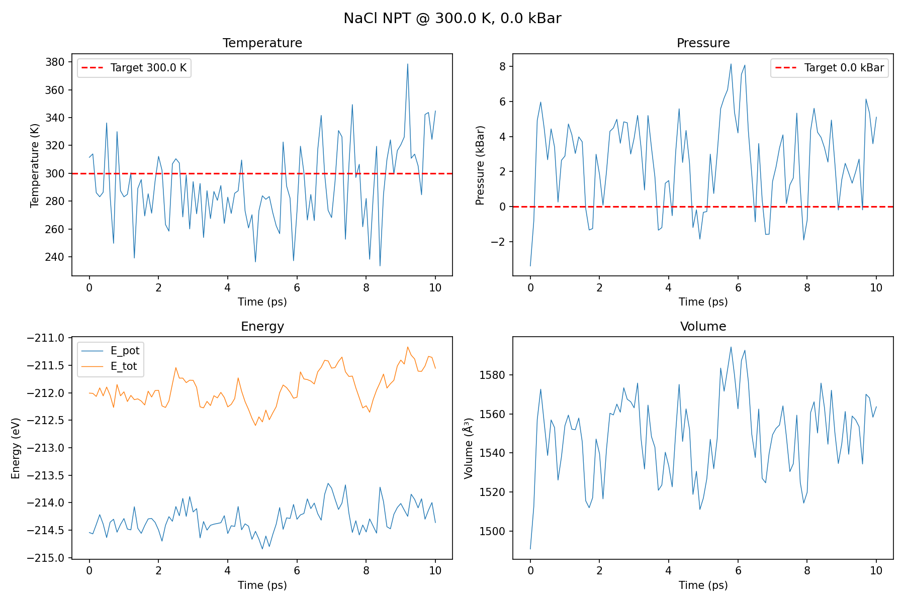
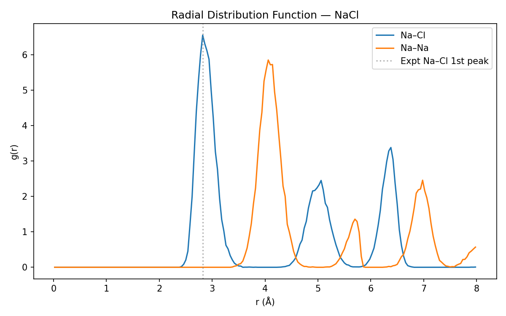
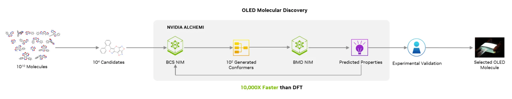
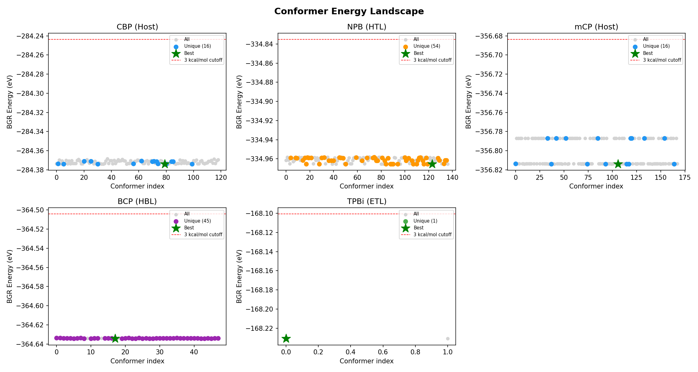

# NVIDIA ALCHEMI: BMD & BGR NIM Playbooks

GPU-accelerated molecular dynamics at **10,000x the speed of DFT** — powered by NVIDIA's Machine-Learning Interatomic Potential (MLIP) NIM microservices. Two interactive Jupyter playbooks walk through real scientific workflows: crystalline materials property extraction (NaCl) and a multi-molecule OLED material screening pipeline inspired by Universal Display Corporation's research methodology.

## Playbooks

### Crystalline Materials Science (`alchemi-playbook-nims.ipynb`)

Build a NaCl supercell from its unit cell, equilibrate it through NVT and NPT molecular dynamics via the BMD REST API, and extract publication-quality thermodynamic properties — density, radial distribution functions, mean-square displacement, diffusion coefficients, and thermal expansion across a temperature sweep.

<p align="center">
  
  
</p>
<p align="center">
  
</p>

**What you will learn:**
- Connect to ALCHEMI BMD/BGR endpoints and interpret request/response schemas
- Build crystalline supercells programmatically with pymatgen
- Run NVT and NPT molecular dynamics simulations via the REST API
- Extract thermodynamic properties: density, RDF, MSD, diffusion, thermal expansion
- Batch simulations for temperature sweeps
- Switch between MLIP models with a single parameter change

---

### OLED Material Screening (`alchemi-conformer-stability.ipynb`)

A UDC-inspired computational screening pipeline that evaluates **5 real OLED host and transport molecules** end-to-end: RDKit conformer generation with energy filtering and RMSD deduplication, BGR geometry optimisation, batched NVT MD at elevated temperature for thermal stability assessment, and composite scoring that ranks candidates by energy variance, structural drift, and bond integrity.

<p align="center">
  
</p>
<p align="center">
  
</p>

| Molecule | Role | Formula |
|----------|------|---------|
| **CBP** | Host | C<sub>36</sub>H<sub>24</sub>N<sub>2</sub> |
| **NPB** | Hole transport | C<sub>44</sub>H<sub>32</sub>N<sub>2</sub> |
| **mCP** | Host | C<sub>25</sub>H<sub>19</sub>N |
| **BCP** | Electron transport | C<sub>26</sub>H<sub>20</sub>N<sub>2</sub> |
| **TPBi** | Electron transport | C<sub>45</sub>H<sub>30</sub>N<sub>3</sub> |

**What you will learn:**
- Generate and filter molecular conformers with RDKit (energy windows, RMSD deduplication)
- Optimise geometries via the BGR NIM endpoint
- Build gas-phase simulation cells with periodic boundary conditions
- Run batched NVT MD at elevated temperature via the REST API
- Score thermal stability from energy statistics, structural RMSD, and bond integrity
- Rank and compare multiple OLED candidates in a single pipeline

## Quick Start

```bash
# Create and activate the environment
conda env create -f environment.yml
conda activate alchemi-playbook

# Install dependencies
uv pip install -r requirements.txt

# Launch a playbook
jupyter notebook alchemi-playbook-nims.ipynb           # Materials science
jupyter notebook alchemi-conformer-stability.ipynb      # OLED screening
```

### FAST_DEMO Mode

Both notebooks default to `FAST_DEMO = False` — they will call **live BMD/BGR endpoints**. Set `FAST_DEMO = True` in each notebook's control panel to use pre-cached JSON responses in `cached_responses/` for fully offline operation with shorter simulations.

## Prerequisites

- **BMD NIM endpoint** running on `localhost:{BMD_PORT}` (default `8000`) — or use `FAST_DEMO = True` for cached responses
- **BGR NIM endpoint** running on `localhost:{BGR_PORT}` (default `8890`) — materials playbook only
- **Python 3.11+** with conda

## Directory Structure

```
alchemi-playbooks/
├── alchemi-playbook-nims.ipynb           # Materials science playbook (NaCl MD)
├── alchemi-conformer-stability.ipynb     # OLED material screening playbook
├── helpers/                              # Shared Python package
│   ├── __init__.py                       # Public API re-exports
│   ├── constants.py                      # Physical/scientific constants
│   ├── models.py                         # Pydantic request/response models
│   ├── api_client.py                     # BMD/BGR NIM client (sync + async)
│   ├── analysis.py                       # MD trajectory analysis (RDF, MSD, thermo)
│   ├── conformers.py                     # RDKit conformer generation & filtering
│   ├── visualization.py                  # OVITO rendering helpers
│   └── cache.py                          # Response caching logic
├── tests/                                # pytest test suite
├── cached_responses/                     # Pre-cached API responses
│   ├── materials/                        # NaCl playbook caches
│   └── conformer-stability/              # OLED screening caches
├── assets/                               # Static images and output showcases
├── outputs/                              # Generated plots and structures (gitignored)
├── environment.yml                       # Conda environment spec
├── requirements.txt                      # Runtime dependencies
└── requirements-dev.txt                  # Dev dependencies (pytest, ruff)
```

## Key Dependencies

numpy, ase, pymatgen, pydantic, requests, aiohttp, matplotlib, pandas, rdkit, ovito

## License

MIT — see [LICENSE.txt](LICENSE.txt).
