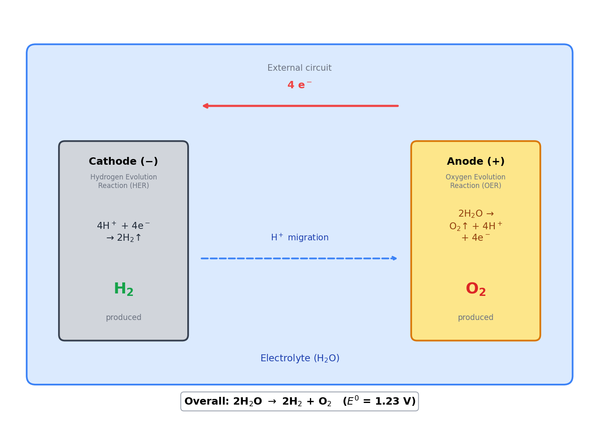
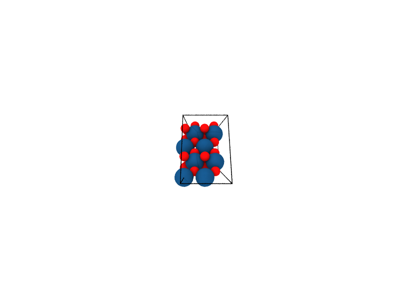
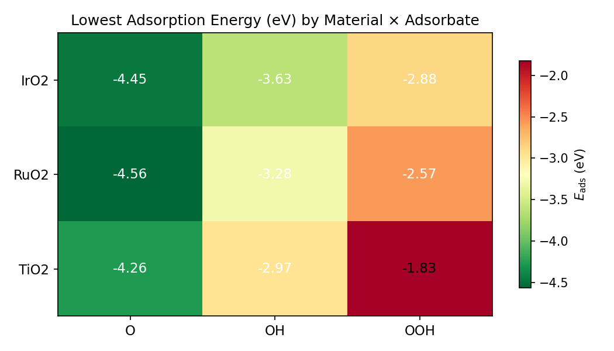
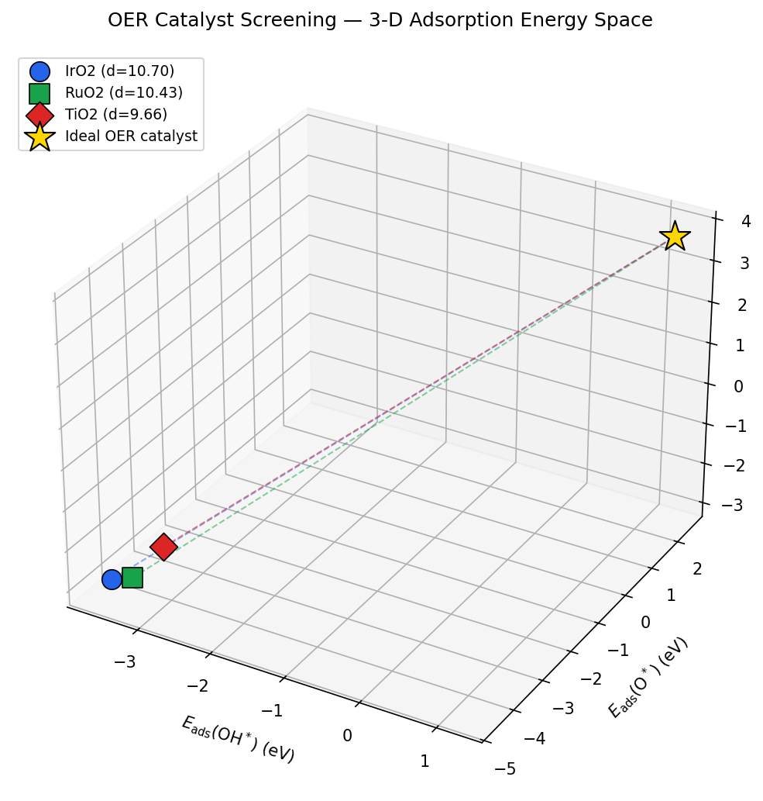

<p align="center">
  
  &nbsp;&nbsp;&nbsp;
  
  &nbsp;&nbsp;&nbsp;
  
</p>

---

# OER Catalyst Screening with NVIDIA ALCHEMI

**75-minute interactive workshop** — screen oxide catalyst surfaces for oxygen-evolution activity using GPU-accelerated machine-learning interatomic potentials.

Built on the **NVIDIA ALCHEMI BGR (Batch Geometry Relaxation) NIM** and the **MACE-MP-0** foundation model, this notebook walks attendees through a complete computational catalyst screening workflow: from bulk crystal construction through adsorption energy ranking — at 10,000× the speed of conventional DFT.

## Output Showcase

<p align="center">
  
  
</p>
<p align="center">
  
  
</p>

## Docker Deployment

### Prerequisites

| Requirement | Details |
|-------------|---------|
| NGC API key | Get one at [build.nvidia.com](https://build.nvidia.com) |
| Docker + Compose | `docker compose` (v2 plugin) on the compute node |
| GPU | NVIDIA GPU with driver support |

### Setup

```bash
cp .env.example .env
# Edit .env and set NGC_API_KEY=<your-key>

docker compose up
```

Access JupyterLab at `http://localhost:8888` and Grafana at `http://localhost:3000` (admin/admin).

### HPC Pipeline

For multi-hop HPC environments (local machine → login node → compute node), use the deployment scripts in `scripts/`:

```bash
# Allocate a GPU node via SLURM
./start

# Deploy the full stack from your local machine
./scripts/deploy.sh setup <login-host> <compute-node>

# Management
./scripts/deploy.sh status       # Jupyter URL, BGR health, Grafana
./scripts/deploy.sh restart      # Sync local changes, restart stack
./scripts/deploy.sh pull-changes # Sync remote Jupyter edits to local
./scripts/deploy.sh stop         # Tear down stack, close tunnels
```

### BGR NIM Configuration

The Docker Compose stack configures the BGR NIM with:

| Setting | Variable | Value |
|---------|----------|-------|
| Model | `ALCHEMI_NIM_MODEL_TYPE` | `mace` (MACE-MPA-0) |
| Boundary conditions | `ALCHEMI_NIM_PBC` | `true` |
| Optimizer preset | `ALCHEMI_NIM_BGR_OPTIMIZER_PRESET` | `materials` |
| Dispersion corrections | `ALCHEMI_NIM_DFT3_ENABLED` | `true` (DFT-D3(BJ)) |
| Shared memory | `--shm-size` | `8g` |

### Monitoring

Prometheus scrapes BGR metrics at `/v1/metrics`. View them in Grafana at `localhost:3000` (datasource auto-provisioned). The BGR status endpoint is also available at `localhost:8000/v1/status`.

## FAST_DEMO Mode

The notebook defaults to `FAST_DEMO = False` — it will call a **live BGR endpoint**. Set `FAST_DEMO = True` in the control panel cell to use pre-cached JSON responses in `cached_responses/oer-catalyst-screening/` for fully offline operation. This is recommended for workshop environments without GPU access.

## References

1. Batatia, I. *et al.* "MACE: Higher Order Equivariant Message Passing Neural Networks for Fast and Accurate Force Fields." *NeurIPS* (2022).
2. Rossmeisl, J. *et al.* "Electrolysis of water on oxide surfaces." *J. Electroanal. Chem.* **607**, 83–89 (2007).
3. Ping, Y., Nielsen, R. J. & Goddard, W. A. "The Reaction Mechanism with Free Energy Barriers at Constant Potentials for the Oxygen Evolution Reaction at the IrO<sub>2</sub>(110) Surface." *J. Am. Chem. Soc.* **139**, 149–155 (2017).
4. Dickens, C. F., Kirk, C. & Norskov, J. K. "Insights into the Electrochemical Oxygen Evolution Reaction with ab Initio Calculations and Microkinetic Modeling." *J. Phys. Chem. C* **123**, 18960–18977 (2019).
5. Stukowski, A. "Visualization and analysis of atomistic simulation data with OVITO." *Model. Simul. Mater. Sci. Eng.* **18**, 015012 (2010).
6. U.S. Geological Survey. "2022 Final List of Critical Minerals." *Federal Register* **87**, 10381 (2022).
7. ENEOS Holdings, Matlantis, and NVIDIA. Collaboration on GPU-accelerated atomistic simulation for catalyst discovery.

## License

Apache 2.0 — see [LICENSE](LICENSE).
