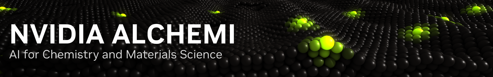

<!-- markdownlint-disable MD033 -->



# NVIDIA ALCHEMI Tutorials

Hands-on notebooks for building GPU-accelerated atomistic simulations with
NVIDIA ALCHEMI.

[ALCHEMI overview](https://developer.nvidia.com/cuda/cuda-x-libraries/alchemi) ·
[Toolkit documentation](https://nvidia.github.io/nvalchemi-toolkit/) ·
[Toolkit examples](https://nvidia.github.io/nvalchemi-toolkit/examples/) ·
[Toolkit source](https://github.com/NVIDIA/nvalchemi-toolkit) ·
[Toolkit-Ops documentation](https://nvidia.github.io/nvalchemi-toolkit-ops/) ·
[Toolkit-Ops examples](https://nvidia.github.io/nvalchemi-toolkit-ops/examples/index.html) ·
[Toolkit-Ops source](https://github.com/NVIDIA/nvalchemi-toolkit-ops)

## About ALCHEMI Toolkit

NVIDIA ALCHEMI brings together domain-specific NIM microservices, Toolkit, and
Toolkit-Ops for chemistry and materials simulation. This repository teaches the
Toolkit path through runnable notebooks.

ALCHEMI Toolkit is a GPU-first Python framework for atomic simulation. Its APIs
cover graph-aware atomic data, model wrappers, batched relaxation and molecular
dynamics, hooks, data loading, model composition, and distributed workflows.
Toolkit-Ops supplies GPU-accelerated primitives for neighbor lists, geometry
optimization, molecular dynamics, dispersion, and electrostatics.

## Start with the Core Playbook

**[Open the ALCHEMI Core Playbook](notebooks/00-core-playbook/alchemi-core-playbook.ipynb)**

The Core Playbook starts with a simple molecule and moves through the main
Toolkit objects and workflows:

`ASE structure → AtomicData → Batch → Zarr → model → hooks → FIRE2`

You will build and inspect atomic data, pack molecules into a batch, save and
load records, evaluate an AIMNet2 model, inspect how the same `Batch` is used
with MACE, attach hooks, and run a batched FIRE2 relaxation. Short previews
introduce molecular dynamics, fused stages, inflight batching, fine-tuning, and
domain parallelism.

## Install and run

### Local installation

Install [`uv`](https://docs.astral.sh/uv/), then create the saved environment
from the repository root:

```bash
./scripts/v3-sync
```

Launch JupyterLab through the same environment:

```bash
./scripts/v3-run jupyter lab
```

The notebook uses CUDA when a compatible NVIDIA GPU is available and selects
smaller workloads for its CPU path. [`uv.lock`](uv.lock) records the Python
environment, and
[`environment/runtime-pins.toml`](environment/runtime-pins.toml) records the
Toolkit, Toolkit-Ops, model, and data sources used by the course.

### Container installation

The container uses the same `uv.lock` and runtime checks as the local
installation. Its build downloads and verifies AIMNet and D3, then downloads
and loads the `medium-0b2` MACE checkpoint. Docker and the NVIDIA Container
Toolkit are required on the host.

Build the image with your user and group IDs so files saved from Jupyter remain
owned by your account:

```bash
docker build \
  --build-arg USER_ID="$(id -u)" \
  --build-arg GROUP_ID="$(id -g)" \
  --tag alchemi-v3-core:local \
  .
```

Create a Jupyter token and start the container. This example publishes Jupyter
on the host loopback address at port 8893:

```bash
mkdir -p .alchemi-runtime
python3 -c 'import secrets; print(secrets.token_urlsafe(24))' \
  > .alchemi-runtime/jupyter-token
chmod 600 .alchemi-runtime/jupyter-token

docker run --detach \
  --gpus all \
  --name alchemi-v3-core \
  --restart unless-stopped \
  --shm-size=8g \
  --publish 127.0.0.1:8893:8888 \
  --env JUPYTER_TOKEN="$(<.alchemi-runtime/jupyter-token)" \
  --volume "$PWD:/workspace" \
  alchemi-v3-core:local
```

Check the server and the saved runtime:

```bash
docker logs alchemi-v3-core
docker exec alchemi-v3-core \
  ./scripts/v3-run python environment/check_runtime.py
docker exec alchemi-v3-core nvidia-smi
```

Open `http://127.0.0.1:8893/lab` and enter the token stored in
`.alchemi-runtime/jupyter-token`.

Use `docker stop alchemi-v3-core` and `docker start alchemi-v3-core` to stop
and restart the saved server.

### Connect to a remote host

When the container runs on `ws-loc`, keep its published port on the remote
loopback address. Start this tunnel in a terminal on your computer:

```bash
ssh -x -N -o ExitOnForwardFailure=yes \
  -L 127.0.0.1:8891:127.0.0.1:8893 \
  ws-loc
```

Keep that terminal open, then visit `http://127.0.0.1:8891/lab` and enter the
token from the remote `.alchemi-runtime/jupyter-token` file.

## Tentative roadmap

Planned work is grouped into three tracks:

- **Deep dives:** focused notebooks on Toolkit data, model interfaces,
  simulation workflows, storage, performance, and distributed execution.
- **R&D examples:** research-oriented adsorption and melting workflows that
  connect Toolkit APIs to complete computational studies.
- **Domain challenges:** larger, open-ended exercises with a scientific goal,
  a defined starting point, and results learners can inspect and compare.

## Project references

| Document | Purpose |
|---|---|
| [Tutorial guide](TUTORIAL_GUIDE.md) | Curriculum, notebook structure, writing, and visual style |
| [Toolkit API reference](TOOLKIT_API_REFERENCE.md) | Public objects, operations, shapes, and release-specific details |
| [Environment guide](environment/README.md) | Saved runtime, setup commands, package pins, and model assets |
| [Third-party notices](THIRD_PARTY_NOTICES.md) | Software, models, data, and redistribution terms |

## Developers who shaped the tutorials

- [Ryan Reese](https://github.com/Ryan-Reese) created the melting-point study
  using NVIDIA ALCHEMI Toolkit.
- [Anoushka Bhutani](https://github.com/anoushka2000) developed companion
  tutorial challenges planned for a future release.

## License

This repository is licensed under Apache 2.0. See [LICENSE](LICENSE).

Models, checkpoints, datasets, figures, and downloaded runtime files may have
separate terms. Review [THIRD_PARTY_NOTICES.md](THIRD_PARTY_NOTICES.md) and the
README beside each input before redistribution.
