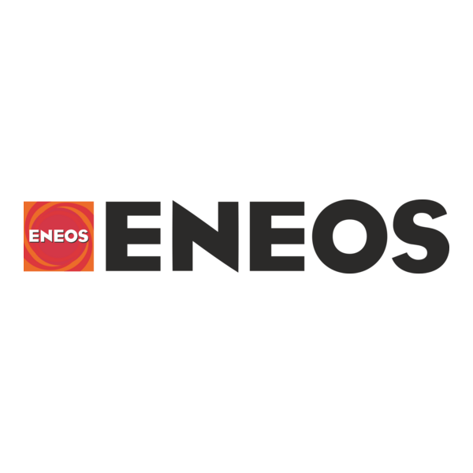

<p align="center">
  
  &nbsp;&nbsp;&nbsp;
  
  &nbsp;&nbsp;&nbsp;
  
</p>

---

# OER Catalyst Screening with NVIDIA ALCHEMI

**75-minute interactive workshop** — screen oxide catalyst surfaces for oxygen-evolution activity using GPU-accelerated machine-learning interatomic potentials.

Built on the **NVIDIA ALCHEMI BGR (Batch Geometry Relaxation) NIM** and the **MACE-MP-0** foundation model, this notebook walks attendees through a complete computational catalyst screening workflow: from bulk crystal construction through adsorption energy ranking — at 10,000× the speed of conventional DFT.

## Scientific Motivation

Hydrogen from water electrolysis is central to the energy transition, but the **oxygen evolution reaction (OER)** at the anode is the bottleneck. Today's best acidic-electrolyser catalyst, **iridium oxide (IrO<sub>2</sub>)**, relies on one of the rarest elements on Earth — iridium is among the [60 critical minerals](https://www.usgs.gov/news/national-news-release/us-geological-survey-releases-2022-list-critical-minerals) identified by the U.S. Geological Survey.

**Computational screening** lets researchers evaluate hundreds of candidate structures *before* committing to experiments. By simulating how oxygen-containing intermediates bind to a catalyst surface, we can rank materials by their predicted activity and focus laboratory work on the most promising candidates.

## What You Will Learn

The notebook is structured as **11 sections** that mirror a real screening study:

| Section | Topic | What you do |
|---------|-------|-------------|
| **1** | Environment Setup | Import packages, configure API endpoints |
| **2** | Endpoint Connectivity | Verify BGR NIM is reachable; inspect health and model metadata |
| **3** | The Oxygen Evolution Reaction | Review the four-step OER mechanism and the thermodynamic framework |
| **4** | Oxide Catalyst Surfaces | Build rutile-type bulk crystals and cleave (110) surface slabs |
| **5** | Clean Slab & Gas-Phase References | Relax pristine slabs and isolated adsorbate molecules |
| **6** | Adsorbate Placement | Position H<sub>2</sub>O, OH, O, and OOH at catalytically active CUS sites |
| **7** | Batched Geometry Relaxation | Submit 30+ slab-adsorbate structures to the BGR NIM in one async batch |
| **8** | Relaxation Quality Control | Classify outcomes (converged, migrated, dissociated, desorbed) |
| **9** | Adsorption Energies | Compute ΔE<sub>ads</sub> and free-energy corrections for each intermediate |
| **10** | Screening Results & Material Ranking | Compare overpotentials, plot volcano-style diagnostics |
| **11** | Extensions & Scaling | Discuss scaling to larger material libraries and multi-site sampling |

## Materials

Three rutile-type (P4<sub>2</sub>/mnm) oxides, all cleaved along the **(110)** plane:

| Material | Role | Why included |
|----------|------|--------------|
| **IrO<sub>2</sub>** | Benchmark catalyst | Best-known acidic OER catalyst; our primary validation target |
| **RuO<sub>2</sub>** | Active comparator | Highly active but less stable under prolonged operation |
| **TiO<sub>2</sub>** | Structural control | Same crystal structure, abundant, but catalytically inactive for OER |

## Output Showcase

When the notebook is executed, the following figures are generated in `outputs/`:

<p align="center">
  
  
</p>
<p align="center">
  
  
</p>

## Quick Start

```bash
# Create and activate the environment
conda env create -f environment.yml
conda activate alchemi-playbook

# Install dependencies
uv pip install -r requirements.txt

# Launch the workshop notebook
jupyter notebook alchemi-oer-catalyst-screening.ipynb
```

### Prerequisites

| Requirement | Details |
|-------------|---------|
| Python | ≥ 3.11 |
| Conda env | `alchemi-playbook` |
| BGR NIM | Running on `localhost` (default port 8000), **or** set `FAST_DEMO = True` |

### FAST_DEMO Mode

The notebook defaults to `FAST_DEMO = False` — it will call a **live BGR endpoint**. Set `FAST_DEMO = True` in the control panel cell to use pre-cached JSON responses in `cached_responses/oer-catalyst-screening/` for fully offline operation. This is recommended for workshop environments without GPU access.

## Docker Quick Start

Run the BGR NIM + Jupyter + monitoring stack with Docker Compose.

### Prerequisites

| Requirement | Details |
|-------------|---------|
| NGC API key | Get one at [build.nvidia.com](https://build.nvidia.com) |
| Docker + Compose | `docker compose` (v2 plugin) |
| GPU | NVIDIA GPU with driver support |

### Setup

```bash
cp .env.example .env
# Edit .env and set NGC_API_KEY=<your-key>

docker compose up
```

Access JupyterLab at `http://localhost:8888` and Grafana at `http://localhost:3000` (admin/admin).

## Directory Structure

```
alchemi-playbooks/
├── alchemi-oer-catalyst-screening.ipynb  # Workshop notebook
├── helpers/                              # Python package
│   ├── __init__.py                       # Public API re-exports
│   ├── constants.py                      # Physical/scientific constants
│   ├── models.py                         # Pydantic request/response models
│   ├── api_client.py                     # BGR NIM client (sync + async)
│   ├── surfaces.py                       # Slab construction & adsorbate placement
│   ├── visualization.py                  # OVITO rendering helpers
│   └── cache.py                          # Response caching logic
├── data/                                 # Data files (rutile parameters, atomic numbers)
├── cached_responses/
│   └── oer-catalyst-screening/           # Pre-cached BGR responses for FAST_DEMO
├── monitoring/                           # Observability configuration
│   ├── prometheus.yml                    # Prometheus scrape config for BGR metrics
│   └── grafana/datasources/             # Grafana auto-provisioned datasources
├── assets/                               # Logos (ENEOS, Matlantis, NVIDIA, OVITO)
├── outputs/                              # Generated figures and structures (gitignored)
├── Dockerfile                            # Jupyter container (conda + OVITO)
├── docker-compose.yml                    # BGR NIM + Jupyter + Prometheus + Grafana
├── .env.example                          # NGC API key template
├── environment.yml                       # Conda environment spec
└── requirements.txt                      # Runtime dependencies
```

## Key Dependencies

numpy, ase, pymatgen, pydantic, requests, aiohttp, matplotlib, pandas, ovito

## References

1. Batatia, I. *et al.* "MACE: Higher Order Equivariant Message Passing Neural Networks for Fast and Accurate Force Fields." *NeurIPS* (2022).
2. Rossmeisl, J. *et al.* "Electrolysis of water on oxide surfaces." *J. Electroanal. Chem.* **607**, 83–89 (2007).
3. Ping, Y., Nielsen, R. J. & Goddard, W. A. "The Reaction Mechanism with Free Energy Barriers at Constant Potentials for the Oxygen Evolution Reaction at the IrO<sub>2</sub>(110) Surface." *J. Am. Chem. Soc.* **139**, 149–155 (2017).
4. Dickens, C. F., Kirk, C. & Norskov, J. K. "Insights into the Electrochemical Oxygen Evolution Reaction with ab Initio Calculations and Microkinetic Modeling." *J. Phys. Chem. C* **123**, 18960–18977 (2019).
5. Stukowski, A. "Visualization and analysis of atomistic simulation data with OVITO." *Model. Simul. Mater. Sci. Eng.* **18**, 015012 (2010).
6. U.S. Geological Survey. "2022 Final List of Critical Minerals." *Federal Register* **87**, 10381 (2022).
7. ENEOS Holdings, Matlantis, and NVIDIA. Collaboration on GPU-accelerated atomistic simulation for catalyst discovery.

## License

Apache 2.0 — see [LICENSE](LICENSE).
