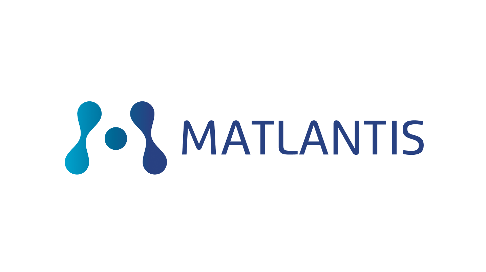
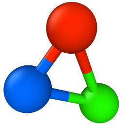

<div align="center">
  <table>
    <tr>
      <td align="center" width="210" height="118"></td>
      <td align="center" width="170" height="118"></td>
      <td align="center" width="260" height="118"></td>
      <td align="center" width="170" height="118"></td>
    </tr>
  </table>
</div>

---

# Batched Atomistic Simulation with NVIDIA ALCHEMI

Partner context: NVIDIA ALCHEMI provides the accelerated tutorial/runtime layer. ENEOS and Matlantis motivate the production oxygen evolution reaction (OER) catalysis-search context, and OVITO is used for structure inspection and rendering. The notebook is a simplified, auditable adsorption tutorial inspired by that real production search.

**Interactive Jupyter tutorial.** This notebook shows how batching changes the practical scale of atomistic simulation. Instead of running one hand-picked structure at a time, the workflow builds many plausible structures with established Python tools, relaxes them in batches with NVIDIA ALCHEMI Toolkit, ranks the results, inspects failures, and keeps reference comparisons honest.

Adsorption configuration search is the worked example because it makes the combinatorial problem visible: surfaces, Miller indices, sites, orientations, heights, and local minima. The active panel is CO, H<sub>2</sub>O, NH<sub>3</sub>, and CH<sub>3</sub>OH on Cu(111), Cu(100), Cu(110), rutile TiO<sub>2</sub>(110), TiO<sub>2</sub>(100), TiO<sub>2</sub>(101), TiN(001), TiN(110), and TiN(210). The same throughput pattern is relevant to real discovery pipelines in catalysis, separations, water harvesting, OER materials, framework screening, and surface chemistry.

NVIDIA ALCHEMI is presented here as an enabling layer for the tools researchers already use. ASE and pymatgen build structures; the surface-screen teaching path uses open MACE checkpoints (machine-learning interatomic potentials, or MLIPs); ALCHEMI provides batching, GPU execution, optimizers, constraints, metadata, and reusable workflow building blocks. The batch-size sweep compares open MACE sizes so readers can see the speed/memory tradeoff before a larger run. Other MACE models, including MACE-MH-1 with an OC20 surface head, can be tested separately by changing the model setup and following the applicable upstream license; those results are not part of the shipped tutorial outputs. DFT-D3(BJ) is available in Toolkit workflows, but it is disabled here because the OC20Dense validation data follows the non-D3 OC20 convention. Quantitative claims are intentionally scoped. Published model-level MAD (Mean Absolute Deviation from DFT) values are recorded for orientation, but they are not run-specific error bars. Strict tutorial-level validation requires exact matching reference records for slab model, coverage, functional, dispersion convention, frozen layers, and energy sign convention. Until those records are added to the reference list, per-pair literature values are treated as contextual checkpoints rather than strict parity data.

## Contents

Open [`alchemi-mace-adsorption-search.ipynb`](alchemi-mace-adsorption-search.ipynb).
The notebook is organized as a live tutorial, not just a report:

1. Frame adsorption as a combinatorial structure-search problem.
2. Introduce the Toolkit objects used in the notebook: `AtomicData`, `Batch`, model wrappers, and `FIRE2`.
3. Run a small H2O batching example and a real adsorption batch-size sweep.
4. Validate the model/workflow against selected OC20Dense DFT trajectories.
5. Build the surface-screen panel step by step: slabs, Miller indices, adsorbates, sites, orientations, and starting heights.
6. Relax the generated structures in batches, rank by `E_ads`, inspect reliability flags, and visualize selected structures.
7. Write reproducible artifacts for review without overwriting saved results by accident.

The companion [`oc20dense-accuracy-reproducibility-check.ipynb`](oc20dense-accuracy-reproducibility-check.ipynb)
keeps the deeper OC20Dense audit surface separate, but the main tutorial already
contains the compact validation checkpoint used in the teaching flow.

## Toolkit/Jupyter Run

### Prerequisites

| Requirement | Details |
|-------------|---------|
| GPU | NVIDIA GPU with enough free VRAM for the selected `RUN_SCOPE` and batch size |
| Toolkit environment | The repository `.venv-toolkit` environment, or an equivalent environment with `nvalchemi-toolkit[ase,mace]`, `nvalchemi-toolkit-ops`, ASE, pymatgen, pandas, matplotlib, ipywidgets, and Jupyter |
| Kernel | Use the Toolkit Python environment as the notebook kernel |

Start Jupyter from the repository root. Make sure the CUDA NVRTC libraries
installed with the venv are visible before the kernel starts:

```bash
cd /path/to/ALCHEMI-Bootcamp
LD_LIBRARY_PATH="$PWD/.venv-toolkit/lib/python3.12/site-packages/nvidia/cu13/lib:$LD_LIBRARY_PATH" \
  .venv-toolkit/bin/jupyter lab --no-browser --ip=127.0.0.1 --port=8888
```

Open `part-1-batched-adsorption/alchemi-mace-adsorption-search.ipynb` first.

## Runtime Modes

`RUN_SCOPE = "short"` runs one representative adsorption example with six starting structures. Use it to check the workflow, kernel, GPU connection, and result tables quickly.

`RUN_SCOPE = "full"` runs the complete active adsorption grid defined in the notebook: 9 surfaces x 4 adsorbates x 6 starts, plus clean-slab and gas-reference relaxations.

The result-source choices are read/write policy, not scientific settings:

- `TUTORIAL_RESULT_SOURCE = "compute"` reruns the main tutorial workflow; `"saved"` reads the saved main tutorial outputs.
- `VALIDATION_RESULT_SOURCE = "compute"` reruns the compact OC20Dense validation; `"saved"` reads the saved validation tables.
- `SAVED_TUTORIAL_RUN_ID` and `SAVED_ACCURACY_RUN_ID` reopen one explicit timestamped run from `outputs/live_runs/<run_id>/`. Leave them `None` for the official saved cache, or set `"latest-complete"` to use the newest live run that passes the required-file checks.
- `REFRESH_SAVED_RESULTS = True` is the explicit overwrite switch for regenerating official saved artifacts.

Leave `REFRESH_SAVED_RESULTS = False` for presentation or exploratory work. With `"compute"` and refresh left off, the notebook writes to `outputs/live_runs/<timestamp>/` instead of replacing official saved results.

The current local notebook defaults to live computation for both the main
tutorial path and the compact validation path. Switch either result source to
`"saved"` when you only want to inspect existing tables and figures.

Data and result layout:

- `outputs/precomputed/tutorial/` -- official saved tutorial outputs.
- `outputs/precomputed/accuracy/` -- official saved OC20Dense validation outputs.
- `outputs/live_runs/<run_id>/` -- interactive reruns. The notebook lists recent runs. It only selects the newest one when you explicitly set the run ID to `"latest-complete"`.
- `outputs/runtime_cache/` -- model/kernel caches that are not scientific results.
- `data/reference/oc20dense-validation-pack.tgz` -- bundled OC20Dense validation pack. It contains the full released DFT trajectories used by this notebook: the three replay cases and the 92 NH3 ranking geometries, plus the mapping/target files needed for reproducibility checks.
- `data/reference/oc20dense/` -- expanded validation source folder created from the tarball when live validation runs. This expanded folder is local and gitignored.

The validation pack is about 73 MB compressed and expands to about 278 MB. It
is intentionally separate from saved output caches: it is source/reference data,
not a precomputed result table. The notebook can unpack it when live validation
needs the reference trajectories. Requests for other OC20Dense ids still need a
full local OC20Dense download/extract, roughly 40 GB. Generated `outputs/`,
runtime caches, and the expanded reference folder are not provided in this
repository.

## Scientific Scope

The tutorial focuses on the throughput-screening part of a discovery pipeline. The calculations report electronic adsorption energies for isolated adsorbates at low coverage. Downstream questions such as activation barriers, electrochemical free energies, explicit solvent effects, coverage-dependent lateral interactions, temperature/entropy corrections, and magnetic/open-shell chemistry need additional methods.

The reusable backend-neutral science contract lives in
[`../shared/adsorption_tutorial`](../shared/adsorption_tutorial/). This Part 1
notebook is the Toolkit teaching implementation of that contract.

The reference layer is deliberately conservative:

- `context` rows support interpretation and plotting.
- `near-strict` rows may support limited quantitative comparison when only minor modeling details differ.
- `strict` rows require an exact match recorded in the reference list, covering the tutorial's slab, adsorbate, coverage, functional, dispersion, frozen-layer convention, and sign convention.

## References

Primary references currently used by the notebook or plan:

1. Batatia, I. et al. "A foundation model for atomistic materials chemistry." arXiv:2401.00096.
2. Lan, J. et al. "AdsorbML: a leap in efficiency for adsorption energy calculations using generalizable machine learning potentials." *npj Computational Materials* 9, 172 (2023).
3. Chanussot, L. et al. "Open Catalyst 2020 (OC20) Dataset and Community Challenges." *ACS Catalysis* 11, 6059 (2021).
4. Tran, R. et al. "The Open Catalyst 2022 (OC22) Dataset and Challenges for Oxide Electrocatalysts." *ACS Catalysis* 13, 3066 (2023).
5. Hammer, B., Morikawa, Y. and Norskov, J. K. "CO chemisorption at metal surfaces and overlayers." *Physical Review Letters* 76, 2141 (1996).
6. Grimme, S. et al. "Effect of the damping function in dispersion corrected density functional theory." *Journal of Computational Chemistry* 32, 1456 (2011).
7. Stukowski, A. "Visualization and analysis of atomistic simulation data with OVITO." *Modelling and Simulation in Materials Science and Engineering* 18, 015012 (2010).

See `references/manual_checks.md` and the reference registry `references/manifest.yml` for the verification state before promoting any contextual number into strict validation.

## License

This tutorial is part of the repository licensed under the Apache License 2.0.
See [LICENSE](../LICENSE).

This tutorial also uses third-party model checkpoints, validation data, and
Python dependencies with their own upstream terms:

| Package or artifact | License | Upstream link |
|---|---|---|
| NVIDIA ALCHEMI Toolkit (`nvalchemi-toolkit`) | Apache License 2.0 | [GitHub](https://github.com/NVIDIA/nvalchemi-toolkit) |
| NVIDIA ALCHEMI Toolkit-Ops (`nvalchemi-toolkit-ops`) | Apache License 2.0 | [GitHub](https://github.com/NVIDIA/nvalchemi-toolkit-ops) |
| MACE-MP/MACE-MPA foundation-model checkpoints | MIT License | [MACE foundation-model registry](https://mace-docs.readthedocs.io/en/latest/guide/foundation_models.html) |
| OC20/OC20Dense validation data | Creative Commons Attribution 4.0 International (CC BY 4.0) | [Open Catalyst OC20](https://fair-chem.github.io/oc20/) |

Retain the applicable third-party notices and attribution when redistributing
model artifacts, dataset artifacts, or derivative tutorial packages.
